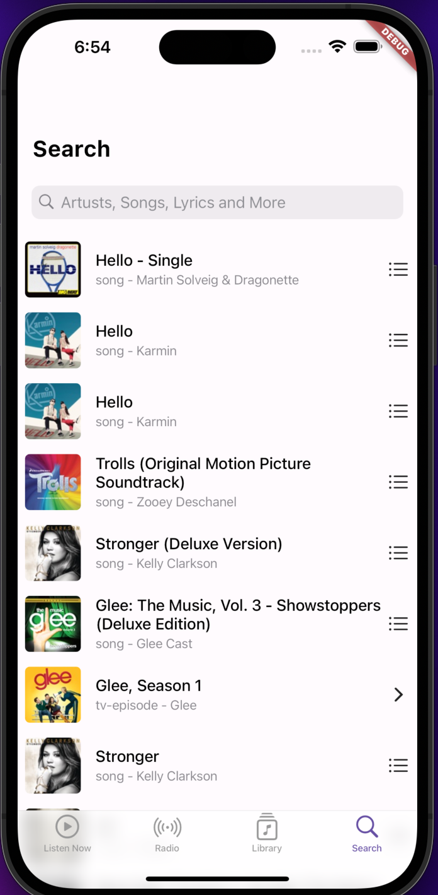

# music_demo
A Flutter Search Music Project 
- Utilize the search api

### How to Run
- flutter run

# Flutter version 
- 3.10.5

## State management
- Bloc

## Route management
- auto route 

## http package
- dio 

## Api references
1. https://developer.apple.com/library/archive/documentation/AudioVideo/Conceptual/iTuneSearchAPI/Searching.html#//apple_ref/doc/uid/TP40017632-CH5-SW1

## File structure

- main.dart
- app.dart
- feature
    - home
    - radio
    - library
    - search

- core
- data
    - service_locator
    - dio_client
    - dio_response

## Screenshot

